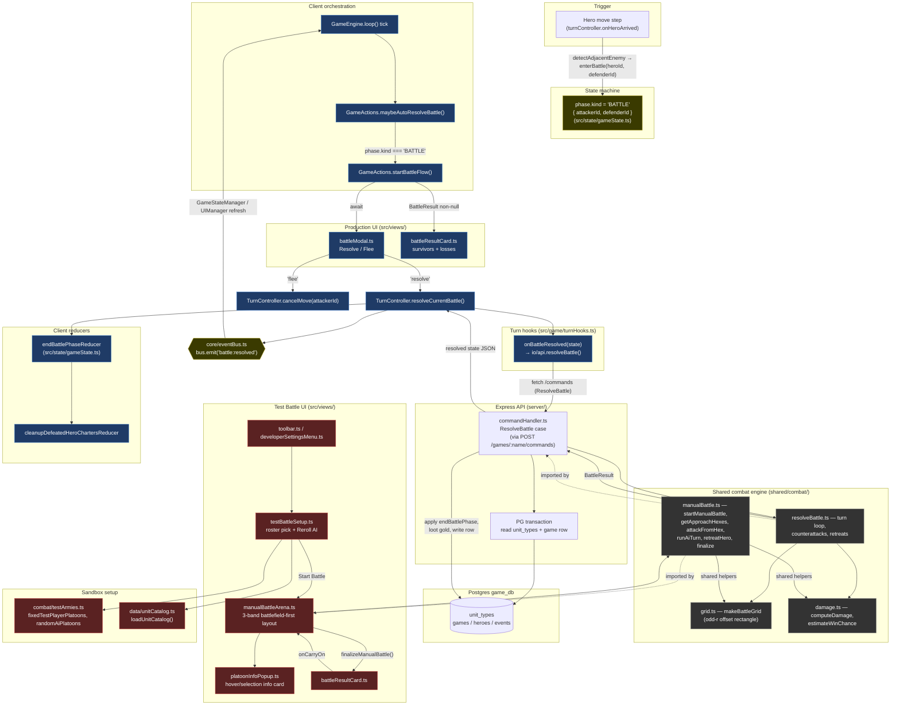

# Battle View Architecture

How a clash between two heroes flows through the UI, the client state
machine, the server resolver, and the shared combat engine. There are
**two entry points** into the battle system that share almost no UI:

1. **Auto-resolve (production)** — the actual game: a hero moves
   adjacent to an enemy, a "Resolve / Flee" modal appears, the server
   runs `resolveBattle()`, and the result is shown in a result card.
2. **Test Battle (sandbox)** — the manual HoMM3-style arena used to
   exercise `shared/combat/manualBattle.ts`. Reachable from the main
   toolbar **and** from Developer Settings.

The shared `shared/combat/*` engine is the **only module imported by
both** `server/routes.ts` and `src/views/manualBattleArena.ts`
(cross-cutting fact, see `docs/module-documentation-and-relationships.md` §9).

> **Status.** The manual arena is **not yet wired to the adventure map.**
> `openManualBattleArena` has exactly one caller — `views/testBattleSetup.ts`.
> Real hero-vs-hero collisions still go through the server auto-resolver.
> Wiring the arena into the production trigger is the open piece of work;
> everything below describes the two paths as they exist today.

> **On line numbers.** This doc deliberately references **symbols, not
> line numbers**. The original draft cited a dozen exact lines and every
> one of them had drifted within a month.

---

## Component map

---

## Two paths side-by-side

### Production — auto-resolve (real game)

1. **Trigger.** `turnController.onHeroArrived` walks the hero along its
   path; each step calls `detectAdjacentEnemyFn(state, hero.id)`. When
   an adjacent enemy hero is found, `enterBattle(attackerId, defenderId)`
   transitions `state.phase.kind` to `BATTLE`.
2. **Detection.** `GameEngine.loop` calls
   `GameActions.maybeAutoResolveBattle()` each tick. If
   `gs.phase.kind === "BATTLE"` and no battle is already in flight, it
   kicks off `startBattleFlow()`.
3. **User choice.** `startBattleFlow()` opens `showBattleModal()`
   (`src/views/battleModal.ts`) — a centered DOM modal with **Resolve**
   or **Flee**. Fled battles call `tc.cancelMove(attackerId)`;
   resolved battles proceed.
4. **Server call.** `TurnController.resolveCurrentBattle()` calls the
   injected hook `hooks.onBattleResolved(state)` (`src/game/turnHooks.ts`
   → `io/api.resolveBattle()` → `POST /api/games/:name/commands` (`ResolveBattle` command)).
5. **Server resolve.** Inside a PG transaction the route loads the game
   row + `unit_types` catalog, normalizes both sides' `stacks` into
   `Platoon[]`, calls `resolveBattleEngine(...)` from
   `shared/combat/resolveBattle.ts`, loots the defender's gold if they
   lost all troops, writes the updated `heroes` back, and returns the
   new state.
6. **Apply + notify.** The client runs `endBattlePhaseReducer`,
   `cleanupDefeatedHeroChartersReducer` if the defeated hero was
   chartering, and emits `bus.emit({ type: "battle:resolved", ... })`.
   `GameStateManager` + `UIManager` react to refresh visuals.
7. **Show the result.** When `resolveCurrentBattle()` returns a
   non-null `BattleResult`, `startBattleFlow` calls
   `showBattleResultCard()` with attacker/defender labels. The result
   card is **shared with the Test Battle path** — it is no longer
   sandbox-only.

### Test Battle (sandbox)

This is **not** part of the real game flow: it exists so the interactive
engine in `shared/combat/manualBattle.ts` can be exercised end-to-end
without an adventure-map collision.

1. **Entry.** `toolbar.ts` ("Test Battle" button, titled *"Sandbox:
   player vs AI manual-fight arena (no effect on your real game)"*) or
   `developerSettingsMenu.ts` → `openTestBattleSetup()`
   (`src/views/testBattleSetup.ts`). Player roster is fixed
   (`testArmies.fixedTestPlayerPlatoons`); AI roster is
   `randomAiPlatoons(unitTypes)` with a Reroll button. Human picks Blue
   or Red.
2. **Start.** "Start Battle" calls
   `openManualBattleArena(playerPlatoons, aiPlatoons, unitTypes, humanSide, options)`.
   Engine roles are fixed to grid colors (attacker always blue, defender
   always red); `humanSide` picks which role the player controls, and
   `sideChoice` deploys the human on the grid's left edge regardless of
   role. `options.heroGold` defaults to 300 so the sandbox always
   exercises the Surrender "Leave Behind" path; real callers would pass
   the hero's actual purse.
3. **Play.** Each click routes through `shared/combat/manualBattle.ts`:
   `getMovementRange` → `movePlatoon` / `attackWithPlatoon` /
   `attackFromHex` / `endPlatoonTurn` for the player, `runAiTurn` for
   the AI. Hovering a platoon raises `platoonInfoPopup.ts` with its
   stats, and hovering an enemy adds a win-odds estimate
   (`damage.estimateWinChance`) against your selected platoon.
4. **Finish.** `finalizeManualBattle()` ends the fight →
   `showBattleResultCard()`. "Carry On" closes the card and returns to
   the setup modal. **Retreat** and **Surrender** exit early via
   `retreatHero` (with and without loss respectively).

---

## The arena UI

`manualBattleArena.ts` is a **battlefield-first three-band layout** —
status bar / battle row / action + log bar:

- **Grid.** Hex size is *solved for the available box* rather than drawn
  at a fixed size and scaled down, and the canvas is 1:1 with its layout
  box over a device-pixel backing store. `makeBattleGrid` emits cells in
  **odd-r offset** coordinates so the pointy-top mapping yields a true
  rectangle instead of a rhombus.
- **Roster rails.** 190px columns of ~33px platoon strips (specialty
  icon, count, HP bar); spent platoons dim. Per-platoon stats live in the
  hover/selection info card, not on the tiles.
- **Approach-hex targeting.** Hovering a reachable enemy latches it and
  reads the approach hex off whichever sixth of its hex the cursor sits
  in (`core/hex.nearestHexEdge`), drawn with a direction arrow. A sector
  pointing at a blocked or unreachable hex snaps to the nearest legal
  side. The latch survives the cursor moving onto one of the approach
  hexes, so clicking that hex directly also works. **Melee only** —
  ranged platoons shoot from where they stand and get their own help text.
- **AI turn.** Stepped on a timer — telegraph the acting platoon with a
  white ring (~320ms), then resolve and repaint (~260ms) — rather than
  resolved synchronously in one repaint.
- **Battle log.** The engine's log is surfaced in the footer, collapsed
  to one line and expandable. It previously only reached `console.log`.

---

## Module roles in the battle view surface

| Module | Layer | Role |
|---|---|---|
| `src/state/gameState.ts` | Reducer | `phase.kind === "BATTLE"`, `endBattlePhaseReducer`, `cleanupDefeatedHeroChartersReducer` |
| `src/state/turnController.ts` | Orchestrator | `enterBattle`, `resolveCurrentBattle`, `cancelMove` |
| `src/managers/GameActions.ts` | Orchestrator | `maybeAutoResolveBattle`, `startBattleFlow`; gates re-entry with `battleInFlight` |
| `src/views/battleModal.ts` | UI (DOM) | Resolve/Flee prompt before applying the server result |
| `src/views/battleResultCard.ts` | UI (DOM) | Per-platoon survivors + losses summary — used by **both** paths |
| `src/views/manualBattleArena.ts` | UI (canvas+DOM) | HoMM3-style interactive arena (sandbox) |
| `src/views/platoonInfoPopup.ts` | UI (DOM) | Hover/selection info card; win-odds vs. your selected platoon |
| `src/views/testBattleSetup.ts` | UI (DOM) | Test Battle roster pick |
| `src/views/toolbar.ts` | UI (DOM) | "Test Battle" entry button |
| `src/views/developerSettingsMenu.ts` | UI (DOM) | Alternate Test Battle entry + Asset Manager |
| `src/combat/testArmies.ts` | Fixtures | `fixedTestPlayerPlatoons()`, `randomAiPlatoons(unitTypes)` |
| `src/data/unitCatalog.ts` | Catalog cache | `/api/units` loader used by Test Battle |
| `src/core/hex.ts` | Geometry | `HEX_DIRECTIONS`, `nearestHexEdge` — canonical direction math |
| `src/game/turnHooks.ts` | Adapter | `onBattleResolved(state)` → `api.resolveBattle` |
| `src/io/api.ts` | Network | Typed `resolveBattle()` fetch wrapper |
| `src/core/eventBus.ts` | Spine | `battle:resolved` event for downstream refresh |
| `shared/combat/grid.ts` | Engine | `makeBattleGrid` (odd-r offset), `deploymentPosition`, `columnOf` |
| `shared/combat/damage.ts` | Engine | Damage math + `totalHealth` / `estimateWinChance` estimators |
| `shared/combat/resolveBattle.ts` | Engine | Auto-resolver turn loop |
| `shared/combat/manualBattle.ts` | Engine | Interactive engine; `getApproachHexes`, `attackFromHex`, `retreatHero`, `timeOfDayForRound` |
| `shared/combat/types.ts` | Engine | `BattleResult`, `Combatant`, `BattleSnapshot`, etc. |
| `server/app/commandHandler.ts` (`ResolveBattle` via `POST /games/:name/commands`) | Server | Loads DB row + `unit_types`, runs `resolveBattleEngine`, persists result |

---

## Key invariants

- **Server is authoritative for combat math.** Both the production flow
  and the unit catalog come from the DB row + `unit_types` table; the
  client only orchestrates the user choice and applies the returned
  state.
- **No hero entity is deleted on loss.** A no-retreat loss just empties
  the platoons and may loot gold; capture / ransom is explicitly out of
  scope.
- **`battleInFlight` re-entry guard** in `GameActions` prevents the modal
  being opened twice if the tick fires again before the promise resolves.
  It is cleared in a `finally`, so a throw mid-flow cannot wedge it.
- **The two engines never mix.** `resolveBattle.ts` is the only resolver
  the server imports; `manualBattle.ts` is only ever driven from the
  client arena. `manualBattle` imports `resolveBattle` for shared
  helpers (`pickTarget`), not the other way around.
- **Approach-hex selection is melee-only.** `getApproachHexes` and
  `attackFromHex` reject ranged actors; ranged platoons attack from
  where they stand.
- **`attackFromHex` validates before it moves.** Everything is checked
  up front, so a rejected move-and-attack can never leave a platoon
  half-committed.
- **No fog of war in battle.** The Spy action and its
  `scoutedBy`/`markContacted` fog were removed as half-baked — every
  platoon is visible to both sides. The parked idea is written up in
  [`../plan/2026-08-15-combat-reveal-fog-of-war.md`](../plan/2026-08-15-combat-reveal-fog-of-war.md).
