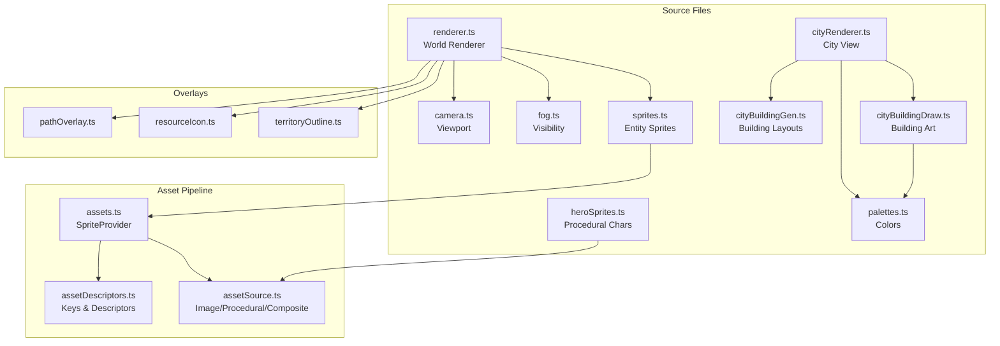
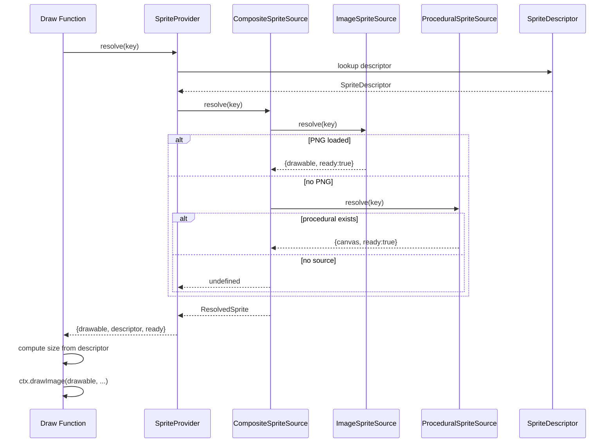
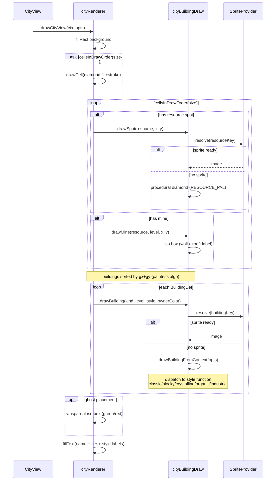
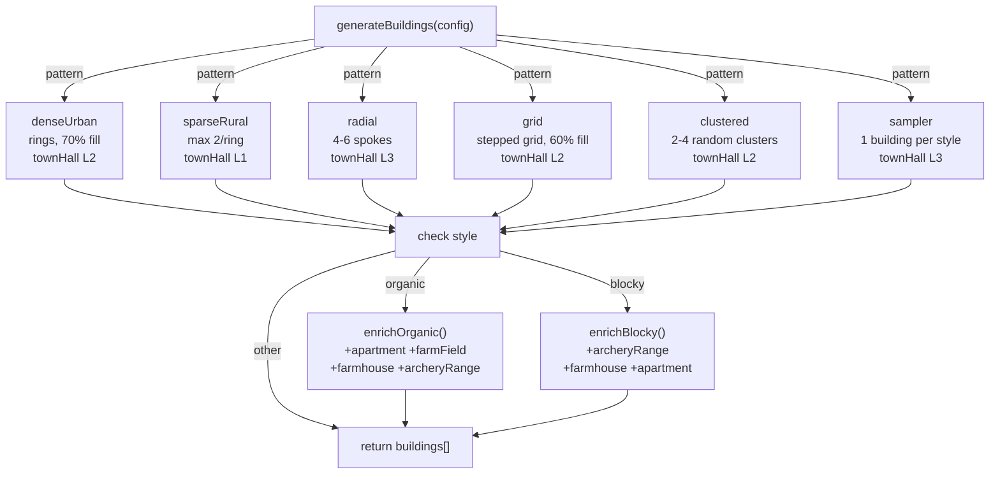
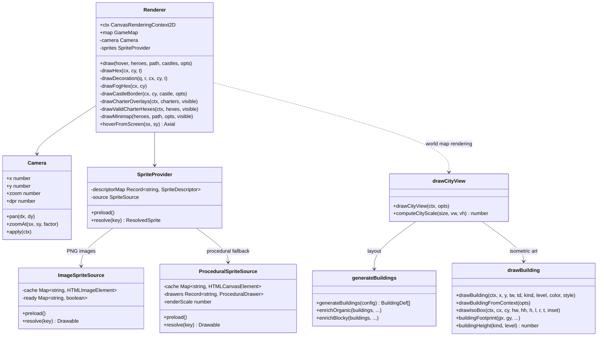

# Render Module — Technical Specification

## Overview

The `src/render/` module is the entire visual layer of Heroes of JS. It draws the hex-map world, settlements, heroes, fog of war, minimap, overlays, and the isometric city view. It is organized into three layers:

1. **Asset Pipeline** — loading, caching, and resolving sprites (images and procedural canvases)
2. **World Renderer** — rendering the hex map with heroes, castles, resources, territory, and fog
3. **City View** — generating and drawing isometric settlement interiors



---

## Table of Contents

- [1. Asset Pipeline](#1-asset-pipeline)
  - [1.1 SpriteKey System](#11-spritekey-system)
  - [1.2 SpriteDescriptor](#12-spritedescriptor)
  - [1.3 Sprite Sources](#13-sprite-sources)
  - [1.4 SpriteProvider](#14-spriteprovider)
  - [1.5 Descriptor Registry](#15-descriptor-registry)
- [2. World Renderer](#2-world-renderer)
  - [2.1 Renderer Class](#21-renderer-class)
  - [2.2 Camera](#22-camera)
  - [2.3 Sprite Drawing Functions](#23-sprite-drawing-functions)
  - [2.4 Fog of War](#24-fog-of-war)
  - [2.5 Overlays](#25-overlays)
    - [2.5.1 Path Overlay](#251-path-overlay)
    - [2.5.2 Resource Icons](#252-resource-icons)
    - [2.5.3 Territory Outlines](#253-territory-outlines)
  - [2.6 Minimap](#26-minimap)
  - [2.7 Charter & Valid-Hex Overlays](#27-charter--valid-hex-overlays)
- [3. City View](#3-city-view)
  - [3.1 City Renderer (`cityRenderer.ts`)](#31-city-renderer-cityrendererts)
  - [3.2 Building Generation (`cityBuildingGen.ts`)](#32-building-generation-citybuildinggents)
  - [3.3 Building Drawing (`cityBuildingDraw.ts`)](#33-building-drawing-citybuildingdrawts)
  - [3.4 Procedural Hero Sprites (`heroSprites.ts`)](#34-procedural-hero-sprites-herospritests)
- [4. Palettes](#4-palettes)
- [5. Sprite Generation Tools](#5-sprite-generation-tools)
  - [5.1 Procedural (pixel-art.html + pixel-gen.mjs)](#51-procedural-pixel-arthtml--pixel-genmjs)
  - [5.2 FLUX AI Generators](#52-flux-ai-generators)
  - [5.3 Manifest (`manifest.mjs`)](#53-manifest-manifestmjs)
- [6. File Reference](#6-file-reference)

---

## 1. Asset Pipeline

### 1.1 SpriteKey System

`assetDescriptors.ts` defines a union type `SpriteKey` that covers every sprite the game can reference:

```typescript
export type SpriteKey =
  | `castle.${CastleLevel}`           // "castle.1" | "castle.2" | "castle.3"
  | `castle-alt.${CastleLevel}`       // "castle-alt.1" | ... FLUX alternate
  | `resource.${ResourceType}`        // "resource.gold" etc.
  | `resource-cart.${ResourceType}`   // cartography pin variant
  | `resource-illust.${ResourceType}` // FLUX illustrated variant
  | `resource-constellation.${ResourceType}`
  | `resource-crest.${ResourceType}`
  | `resource-pile.${ResourceType}`   // isometric pile variant
  | `resource-pile-smol.${ResourceType}`
  | `resource-pile-bubbly.${ResourceType}`
  | `hero.player.${Direction}`        // 8-directional knight sprites
  | `hero.${Faction}`                 // "hero.player" | "hero.enemy" (procedural)
  | `horse.${string}.${Direction}`    // horse variant directional sprites
  | `building.${string}.${string}.${number}`; // "building.classic.house.2"
```

Key helper functions generate the correct keys:
- `castleKey(level, variant?)` — returns `castle.${level}` or `castle-alt.${level}` based on optional variant
- `resourceKey(type)` / `resourceCartKey(type)` / `resourceStyleKey(type, style)` — resource naming
- `heroKey(faction)` / `heroDirectionKey("player", dir)` — hero sprite lookup
- `horseBubblyKey(dir)` through `horseSamuraiKey(dir)` — per-variant directional lookup
- `buildingKey(style, kind, level)` — city building lookup

### 1.2 SpriteDescriptor

Each sprite is described by a `SpriteDescriptor`:

| Field | Type | Purpose |
|-------|------|---------|
| `key` | `SpriteKey` | Unique identifier |
| `url` | `string \| null` | PNG URL (null = procedural only) |
| `anchor` | `"bottom" \| "center"` | Draw anchor point |
| `sizing` | `Sizing` | How to scale the image |
| `naturalSize` | `number?` | Base pixel size for procedural sprites |
| `anchorOffsetY` | `number?` | Extra Y offset from anchor (used for tall sprites) |

`Sizing` is a discriminated union:
- `{ kind: "abs"; size: number }` — fixed pixel height
- `{ kind: "fitHeight"; hexSizeMul: number }` — scale relative to hex cell height
- `{ kind: "fitWidth"; hexSizeMul: number }` — scale relative to hex cell width

### 1.3 Sprite Sources

`assetSource.ts` implements the source chain pattern. All sources implement:

```typescript
interface SpriteSource {
  preload(): void;
  resolve(key: string): { drawable: Drawable; ready: boolean } | undefined;
}
```

**`ImageSpriteSource`** — Loads PNGs from URLs. Maps sprite keys to `` elements. Tracks load status via `onload`/`onerror` events.

**`ProceduralSpriteSource`** — Generates sprites on the fly using `ProceduralDrawer` functions (signature: `(ctx, size) => void`). Renders at 4× scale onto an offscreen canvas for crisp downscaling.

**`CompositeSpriteSource`** — Chains multiple sources. Attempts resolution in order; returns the first match. This allows PNG images to take priority over procedural fallbacks.

### 1.4 SpriteProvider

`assets.ts` defines `SpriteProvider`, the central lookup for all sprites:

```typescript
class SpriteProvider {
  constructor(source: SpriteSource, descriptors: readonly SpriteDescriptor[])
  preload(): void
  resolve(key: SpriteKey): ResolvedSprite | undefined
}
```

`resolve()` returns a `ResolvedSprite` containing:
- `drawable` — `HTMLImageElement` or `HTMLCanvasElement`
- `descriptor` — the matching `SpriteDescriptor`
- `ready` — whether the image has loaded

`createDefaultProvider(proceduralDrawers)` is the factory used at startup. It:
1. Scans all descriptors, separating image URLs from procedural keys
2. Creates an `ImageSpriteSource` for all URL-backed descriptors
3. Creates a `ProceduralSpriteSource` for any supplied drawers
4. Composes them with a `CompositeSpriteSource` (images first, procedural second)



### 1.5 Descriptor Registry

`assetDescriptors.ts` exports pre-built descriptor maps:

| Export | Record Key | Count |
|--------|-----------|-------|
| `CASTLE_DESCRIPTORS` | `castle.1`, `.2`, `.3` | 3 |
| `CASTLE_ALT_DESCRIPTORS` | `castle-alt.1`, `.2`, `.3` | 3 |
| `RESOURCE_DESCRIPTORS` | `resource.{gold,wood,stone,iron,arcane}` | 5 |
| `RESOURCE_CART_DESCRIPTORS` | `resource-cart.{...}` | 5 |
| `RESOURCE_ILLUST_DESCRIPTORS` | `resource-illust.{...}` | 5 |
| `RESOURCE_CONSTELLATION_DESCRIPTORS` | `resource-constellation.{...}` | 5 |
| `RESOURCE_CREST_DESCRIPTORS` | `resource-crest.{...}` | 5 |
| `RESOURCE_PILE_DESCRIPTORS` | `resource-pile.{...}` | 5 |
| `RESOURCE_PILE_SMOL_DESCRIPTORS` | `resource-pile-smol.{...}` | 5 |
| `RESOURCE_PILE_BUBBLY_DESCRIPTORS` | `resource-pile-bubbly.{...}` | 6 |
| `HERO_PLAYER_DESCRIPTORS` | `hero.player.{n,ne,e,se,s,sw,w,nw}` | 8 |
| `HERO_DESCRIPTORS` | `hero.player`, `hero.enemy` | 2 |
| `HORSE_BUBBLY_DESCRIPTORS` through `HORSE_SAMURAI_DESCRIPTORS` | 7 variants × 4–8 directions each | ~42 |
| `BUILDING_DESCRIPTORS` | `building.{style}.{kind}.{level}` | 6 |

`ALL_DESCRIPTORS` concatenates all of the above into a flat array used by `createDefaultProvider()`.

#### Castle Sprites

| Level | Key | File | Size | hexSizeMul | anchorOffsetY |
|-------|-----|------|------|------------|---------------|
| 1 | `castle.1` | `castle-l1.png` | 96×80 | 1.5 | - |
| 2 | `castle.2` | `castle-l2.png` | 112×112 | 2.2 | 8 |
| 3 | `castle.3` | `castle-l3.png` | 128×160 | 3.0 | 16 |

Alternate (FLUX-generated) variants use the same sizing with `castle-alt.1/2/3` keys.

#### Horse Variant Sprites

Each variant loads from `resources/units/horse/commander-{N}/`:

| Commander | Variant | Key Pattern | Directions | Fallback |
|-----------|---------|-------------|------------|----------|
| 1 | hero (player) | `hero.player.{dir}` | 8 (all) | none |
| 2 | bubbly | `horse.bubbly.{dir}` | 6 | n→nw, s→se |
| 3 | shadow | `horse.shadow.{dir}` | 4 (N/E/S/W) | diags → cardinals |
| 4 | paladin | `horse.paladin.{dir}` | 4 | diags → cardinals |
| 5 | ranger | `horse.ranger.{dir}` | 4 | diags → cardinals |
| 6 | arcane | `horse.arcane.{dir}` | 4 | diags → cardinals |
| 7 | unicorn | `horse.unicorn.{dir}` | 4 | diags → cardinals |
| 8 | samurai | `horse.samurai.{dir}` | 4 | diags → cardinals |

---

## 2. World Renderer

### 2.1 MapRenderer Class

`renderer.ts` exports `MapRenderer`, the main game-world draw controller. Internally, `MapRenderer.draw()` is a thin orchestrator that owns only the camera transform (`ctx.save` → `camera.apply` → painter calls → `ctx.restore`) and delegates every paint call to a per-kind class under `painter/` (`BackgroundPainter`, `HexTerrainPainter`, `CharterPainter`, `CastlePainter`, `HexHoverPainter`, `HeroPainter`). The public constructor signature, `draw(...)`, `hoverFromScreen(...)`, and the `map` field are unchanged from the pre-decomposition `Renderer`; callers (`ViewManager.ts`, `adventureView.ts`) were updated in place.

**Constructor** receives the canvas 2D context, the `GameMap`, the `Camera`, and a `SpriteProvider`.

**`draw(hover, heroes, path, castles, opts)`** is the main frame call. It performs the following in order:

| Step | Operation | Description |
|------|-----------|-------------|
| 1 | Background fill | Clears canvas to `#0a0a0a` |
| 2 | Visibility computation | Calls `computeVision()` for fog of war set |
| 3 | Hex terrain | Draws every map tile (fill + stroke + decoration) |
| 4 | Fog overlay | Draws semi-transparent fog over non-visible tiles |
| 5 | Resource icons | Draws resource rune-stone sprites on resource tiles |
| 6 | Charter overlays | Draws charter target hex outlines |
| 7 | Valid charter hexes | Draws green dashed outlines for valid charter placement |
| 8 | Castle sprites | Draws castle/fortress/settlement sprites on the map |
| 9 | Territory outlines | Draws colored boundary lines around owned territory |
| 10 | Path overlay | Draws movement path (reachable/unreachable segments) |
| 11 | Hero sprites | Draws hero characters (procedural or image-based) |
| 12 | Hero indicators | Draws player-color dots, selection rings |
| 13 | Minimap | Draws the bottom-right corner minimap |

```mermaid
sequenceDiagram
    participant GE as GameEngine
    participant R as Renderer
    participant F as fog.ts
    participant O as Overlays
    participant S as sprites.ts
    participant M as Minimap

    GE->>R: draw(hover, heroes, path, castles, opts)
    R->>R: fillRect(0,0,w,h) #0a0a0a
    R->>F: computeVision(heroes, castles, playerId)
    F-->>R: Set&lt;q,r&gt;
    loop every map tile q,r
        R->>R: drawHex(x,y,terrain)
        alt tile in visible set
            R->>R: drawDecoration(q,r,...)
        else fog
            R->>R: drawFogHex(x,y)
        end
    end
    R->>O: drawResourceIcons(map, visible)
    R->>O: drawCharterOverlays(charters, visible)
    R->>O: drawValidCharterHexes(hexes, visible)
    rect rgb(230, 245, 230)
        Note over R,S: back-to-front z-order (q+r sort)
        loop each castle
            R->>S: drawCastleSprite(level, variant)
        end
    end
    R->>O: drawTerritoryOutlines(castles, visible)
    R->>O: drawPathOverlay(heroes, path, map)
    rect rgb(230, 245, 230)
        loop each hero
            alt horseVariant == "hero"
                R->>S: drawHeroSprite(faction, direction, scaleY)
            else other variant
                R->>S: drawHorseSprite(variant, direction)
            end
            R->>R: draw selection ring + color dot
        end
    end
    R->>M: drawMinimap(heroes, path, visible)
```

**`RenderOptions`** controls rendering behavior:

| Option | Type | Purpose |
|--------|------|---------|
| `selectedHeroId` | `string \| null` | Which hero to highlight |
| `selectedSettlementId` | `string \| null` | Which settlement to highlight |
| `colorForOwner` | `(ownerId) => string` | Player-color mapping function |
| `viewPlayerId` | `number` | Which player's perspective to render |
| `pathReachableIdx` | `number?` | Override for reachable path split |
| `pathOrigin` | `Axial?` | Anchor the path preview to this tile |
| `selectedHeroTile` | `Axial?` | Fallback path origin |
| `activeCharters` | `CharterState[]` | Charter settlement targets |
| `validCharterHexes` | `Set<string> \| null` | Valid charter placement hexes |

**Terrain decorations**: `drawDecoration(q, r, cx, cy, t)` renders per-tile decorations:
- **Forest**: Dark green triangle tree + brown trunk
- **Water**: Curved white reflection arcs
- **Desert**: Sand grain strokes + scattered dots
- **Mountain**: Gray triangle + white snow cap

Each decoration's position is jittered using `decorationSeed(q, r)` which uses `Math.sin(q * 91.71 + r * 43.17)` for deterministic pseudo-random offsets.

### 2.2 Camera

`camera.ts` manages viewport pan and zoom:

```typescript
class Camera {
  x: number;    // world-space offset for pan
  y: number;
  zoom: number; // clamped 0.25–3.0
  dpr: number;  // device pixel ratio

  pan(dx, dy): void
  zoomAt(screenX, screenY, factor): void
  apply(ctx): void  // applies transform to canvas context
}
```

`apply(ctx)` sets the canvas transform matrix:
```
ctx.setTransform(dpr * zoom, 0, 0, dpr * zoom, dpr * x, dpr * y)
```

`hoverFromScreen(sx, sy)` does the inverse: converts a screen coordinate to an axial hex coordinate by dividing out the camera transform and calling `pixelToAxial()`.

### 2.3 Sprite Drawing Functions

`sprites.ts` provides the drawing entry points for all map-level entities:

**`drawCastleSprite(ctx, provider, level, cx, cy, hexSize, variant?)`**
- Resolves `castleKey(level, variant)` from the sprite provider
- If a FLUX pre-rendered sprite exists, draws it at the computed size; otherwise falls back to the procedural pixel-art sprite
- `variant` (0 = original, 1 = FLUX alternate) defaults to 0
- Sizing uses `fitHeight` with `hexSizeMul` from the descriptor

**`drawResourceIcon(ctx, provider, resource, cx, cy, hexSize)`**
- Resolves via `resourceStyleKey(resource, settings().resourceStyle)` supporting 8 styles
- Tries the pre-rendered sprite first; falls back to procedural diamond shape with rune palette
- Sizing uses `fitWidth` with `hexSizeMul: 0.9`

**`drawHeroSprite(ctx, provider, faction, cx, cy, direction, hexSize, scaleY?)`**
- `faction === "player"` uses `heroDirectionKey("player", direction)` for 8-directional sprites
- `faction !== "player"` uses `"hero.enemy"` (procedural demon, single direction)
- Supports vertical scale animation via `scaleY` parameter (bobbing when moving)

**`drawHorseSprite(ctx, provider, variant, cx, cy, direction, hexSize)`**
- Handles 7 image-based horse variants: bubbly, shadow, paladin, ranger, arcane, unicorn, samurai
- Uses directional fallback for missing diagonal sprites
- `HORSE_VARIANT_KEYS` maps each variant name to its key-generating function

**`drawWithDescriptor(ctx, drawable, desc, cx, cy, hexSize)`** — the shared sizing/placement engine:
- Reads `naturalW`/`naturalH` from the drawable
- Computes final `w`/`h` based on `desc.sizing`
- Positions via `desc.anchor` ("center" or "bottom")
- Applies `anchorOffsetY` for tall sprites that need to sit below the anchor point

The renderer uses per-hero variant selection: each hero's `horseVariant` field determines whether `drawHeroSprite()` (variant `"hero"`) or `drawHorseSprite()` (all other variants) is called.

### 2.4 Fog of War

`fog.ts` implements visibility computation:

```typescript
const VISION_RANGE = 4;
function computeVision(heroes, castles, viewPlayerId, range?): Set<string>
function isVisible(visible, q, r): boolean
```

- **Heroes** contribute a visibility ring of `VISION_RANGE` (4 hexes) around their position
- **Castles** contribute a visibility ring based on `controlRange(level)` (which increases with settlement level)
- Returns a `Set<string>` of `"q,r"` keys representing visible hexes

In the renderer, non-visible hexes are covered with a semi-transparent fog overlay:
- Fill: `rgba(8, 10, 16, 0.78)`
- Stroke: `rgba(8, 10, 16, 0.55)`

The minimap also respects fog: visible hexes show terrain colors; non-visible hexes show `rgba(0,0,0,0.85)`.

### 2.5 Overlays

#### 2.5.1 Path Overlay

`overlays/pathOverlay.ts` draws movement paths:

- **`computeReachableSplit(path, map, movementRemaining)`** — walks the path accumulating terrain movement costs. Returns the index where cumulative cost exceeds `movementRemaining`, splitting the path into reachable (gold) and unreachable (dim) segments.
- **`drawPathSegment(ctx, points, fromIdx, toIdx, color, lineWidth, dotRadius)`** — draws a line segment with dots at waypoints
- **`drawTrail(ctx, hero, opts)`** — draws the hero's movement history trail (faint dots + line in player color)
- **`drawPathOverlay(ctx, heroes, path, map, opts)`** — main entry; draws the full proposed path with reachable/unreachable split and the selected hero's trail
- **`drawMinimapPath(ctx, path, x0, y0, cellW, cellH)`** — draws path cells on the minimap grid

Colors:
- Reachable: `rgba(255, 204, 0, 0.85)` (bright gold)
- Unreachable: `rgba(255, 204, 0, 0.30)` (dim gold)
- Minimap: `rgba(255, 204, 0, 0.50)`

#### 2.5.2 Resource Icons

`overlays/resourceIcon.ts` iterates all resource tiles on the map within visible range and calls `drawResourceIcon()` for each.

#### 2.5.3 Territory Outlines

`overlays/territoryOutline.ts` draws colored boundary lines around player-controlled territory:

1. Groups all owned castles by `ownerId`
2. Computes controlled hex positions using `controlledPositions()` per castle
3. If multiple players: partitions contested hexes by nearest-castle distance using `hexDistance()`
4. Computes boundary edges via `territoryBoundaryEdges()` (perimeter of the union of controlled hexes)
5. Draws each edge as a line segment in the owner's color with `globalAlpha: 0.45`

Line width is controlled by `settings().territoryBorderWidth` (clamped 1.5–6).

### 2.6 Minimap

Drawn in the bottom-right corner of the screen after all world elements:

- Size: proportional to map aspect ratio, width fixed at 180px
- Background: `rgba(0,0,0,0.6)` with 4px padding + white border
- Each hex renders as a rectangle of `cellW × cellH` pixels
- Visible hexes: terrain fill color
- Non-visible hexes: black (`rgba(0,0,0,0.85)`)
- Resource tiles: small orange dots in the top-right corner of the cell
- Path: gold rectangle overlay via `drawMinimapPath()`
- Heroes: player-color filled rectangles

### 2.7 Charter & Valid-Hex Overlays

**Charter overlays** (`drawCharterOverlays`): For each active charter, draws a hex outline at the target position. Traveling charters get dashed lines; constructing charters get solid lines. Constructing charters also show a small house icon shape (triangle + diamond).

**Valid charter hexes** (`drawValidCharterHexes`): Draws green dashed outlines (`rgba(100, 220, 100, 0.6)`) with faint fill on all valid charter placement hexes.

---

## 3. City View

### 3.1 City Renderer (`cityRenderer.ts`)

`drawCityView(ctx, opts)` renders an isometric settlement interior when the player opens a city.

**`DrawCityViewOptions`**:

| Field | Type | Purpose |
|-------|------|---------|
| `viewportW`/`viewportH` | `number` | Viewport dimensions |
| `settlementName` | `string` | Display name |
| `size` | `5 \| 10 \| 15` | Grid size (L1/L2/L3) |
| `hover` | `{gx,gy} \| null` | Hovered cell for highlight |
| `ownerColor` | `string?` | Player color for tinting |
| `provider` | `SpriteProvider` | For pre-rendered building sprites |
| `citySpots` | `Array` | Resource spots on grid |
| `cityMines` | `Array` | Mine structures |
| `buildings` | `BuildingDef[]` | Placed buildings |
| `style` | `GenerationStyle` | Visual style |
| `pattern` | `string` | Layout pattern name |
| `ghost` | `{...} \| null` | Placement preview |

**`computeCityScale(size, viewportW, viewportH)`** — computes the tile scale so the full city fits within 85% of the viewport.

**Render order** (back-to-front for correct z-ordering):

1. Background fill (`#1a1620`)
2. Grid cells: diamond tiles in draw order (`cellsInDrawOrder()`), fill `#2a2438`, stroke `#3a3450`, hovered cell gets gold stroke
3. Resource spots: colored diamonds with rune icon (attempts sprite first, falls back to `RESOURCE_PAL` procedural shape)
4. Mines: isometric boxes (walls + roof) with resource palette, level number label, and resource spot icon behind
5. Buildings: sorted by `gx + gy` (painter's algorithm), each drawn via `drawBuilding()`
6. Ghost building: transparent preview (green = valid, red = invalid) at the hovered cell
7. Name label (top-left, 14px white)
8. Info overlay: tier label + style label + pattern name (top-left below name, 11px, 70% opacity)

**Tier labels**: `"5×5 Settlement"`, `"10×10 Town"`, `"15×15 Castle"`

**Style labels**: `"Classic Fantasy"`, `"Blocky Pixel"`, `"Crystalline Elven"`, `"Organic Wooden"`, `"Industrial Dwarven"`



### 3.2 Building Generation (`cityBuildingGen.ts`)

**`GenerationConfig`**:

```typescript
interface GenerationConfig {
  size: CityViewSize;       // 5 | 10 | 15
  pattern: GenerationPattern;
  style: GenerationStyle;
  seed: number;
  townHallAt: { gx, gy };   // always center cell
}
```

**`GenerationPattern`** (6 patterns):



| Pattern | TownHall Level | Description |
|---------|---------------|-------------|
| `denseUrban` | 2 | Rings of buildings, 70% fill, weighted toward houses/markets |
| `sparseRural` | 1 | Max 2 buildings per ring, houses/mines/smithies |
| `radial` | 3 | 4–6 spokes from center, probability decays with distance |
| `grid` | 2 | Stepped grid layout, 60% fill, any building kind |
| `clustered` | 2 | 2–4 random clusters with Manhattan-distance falloff |
| `sampler` | 3 | One building per style for preview/comparison |

**RNG**: Uses an LCG (multiply-with-carry) seeded PRNG: `s = (s * 1664525 + 1013904223) | 0`, scaled to [0,1). This ensures deterministic layouts for the same seed.

**Post-generation enrichment**:
- `enrichOrganic()` adds apartment, archery range, 2×2 farm field, and farmhouse
- `enrichBlocky()` adds archery range, farmhouse, and apartment/highrise

**`BuildingDef`** — each building in the layout:

```typescript
interface BuildingDef {
  gx, gy: number;       // grid position
  kind: BuildingKind;   // 12 types
  level: number;        // 1–3
  style: GenerationStyle;
  w?, h?: number;       // multi-cell width/height (default 1)
}
```

### 3.3 Building Drawing (`cityBuildingDraw.ts`)

**`BuildingKind`** (12 types): `townHall`, `house`, `tower`, `mageGuild`, `mine`, `market`, `barracks`, `smithy`, `apartment`, `farmField`, `farmhouse`, `archeryRange`

**Building drawing flow**:

1. `drawBuilding(ctx, x, y, tw, td, kind, level, ownerColor, style, provider)`
   - Tries to resolve a pre-rendered sprite via `buildingKey(style, kind, level)`
   - If found and ready, draws the image
   - Otherwise falls through to procedural code

2. `drawBuildingFromContext(opts)` dispatches to one of 5 style-specific functions based on `opts.style`

3. Each style function calls `getOpts(o)` which computes `{cx, cy, hw, hh}` from the building's grid position via `buildingFootprint()`

4. `drawIsoBox(ctx, cx, cy, hw, hh, height, fillLeft, fillRight, fillTop, inset)` — the core isometric primitive. Draws three faces:
   - **Left face**: filled with `fillLeft`, stroked with darkened version
   - **Right face**: filled with `fillRight`, stroked with darkened version
   - **Top face** (optional): filled with `fillTop`

5. `buildingHeight(kind, level)` — returns pixel height: `base[kind] + (level - 1) * 12`, where base heights range from 6 (farmField) to 56 (tower)

6. `buildingFootprint(gx, gy, gridOrigin, screenOrigin, tileScale, w, h)` — computes the multi-cell iso diamond footprint for buildings that span multiple grid cells

**Style-specific drawing**:

| Style | Core Primitives | Details |
|-------|----------------|---------|
| **classic** | Iso box + triangular roof | Door/window on house/market, plaque on townHall. Colors derived from `ownerColor` via `lighten()`/`darken()` |
| **blocky** | Stacked stepped boxes with `shrink = l * (hw * 0.15)` per tier | Flag on tower, black door, windows on house/market. Uses `BUILDING_PALETTES.blocky`. Special functions: `drawBlockyArcheryRange`, `drawBlockyFarmhouse`, `drawBlockyHighrise` |
| **crystalline** | 3+level crystal spires from `drawCrystalSpire()` | Translucent facets with `globalAlpha`, glowing orb on mageGuild/townHall. Colors from `ownerColor` |
| **organic** | Iso box + quadratic-curve thatched roof | Rounded door (ellipse), wood-grain strokes, thatch texture lines. Uses `BUILDING_PALETTES.organic`. Special: `drawOrganicApartment` (stacked floors with window bands), `drawOrganicFarmField` (furrows + crops + fence), `drawOrganicFarmhouse` (house + haybale), `drawOrganicArcheryRange` (shelter + targets with arrows) |
| **industrial** | Stone/metal boxes with flat roof diamond | Chimney + smoke particles on smithy/mine, metal studs on townHall/barracks, arrow slit on tower. Uses `BUILDING_PALETTES.industrial` |

**Spot & Mine drawing**:
- `drawSpot()` — draws a resource icon on a city grid cell. Tries sprite provider first; falls back to a colored diamond from `RESOURCE_PAL`
- `drawMine()` — draws a resource-styled isometric mine structure (walls + roof) with the resource spot icon behind it and a level number label

### 3.4 Procedural Hero Sprites (`heroSprites.ts`)

Two hand-crafted pixel art sprites using character-array encoding:

**Knight** (22×18 pixels): Silver-armored knight with red plume, golden shield, brown boots. 15-color palette using single-character codes (`.`=transparent, `K`=dark outline, `G`=silver armor, `R`=red, `Y`=gold, etc.).

**Demon** (22×18 pixels): Dark red demon with gold eyes, bat-like silhouette, and dark aura. 6-color palette.

Both are parsed at first use via `parseSprite(art, palette)` which converts character arrays to `{x, y, color}` pixel arrays, then rendered via `drawSprite(ctx, sprite, xOffset, yOffset)` as 1px rectangles.

Exported as `ProceduralDrawer` functions:
- `drawKnightSprite` — used when `heroVariant === "hero"` for player heroes
- `drawDemonSprite` — used for AI enemy heroes

Both center the sprite horizontally within the rendering canvas.

---

## 4. Palettes

`palettes.ts` defines two palette systems:

### Resource Palette (`RESOURCE_PAL`)

Used for resource rune-stone icons, spots, mines, and food. Each resource has 6 color fields:

| Field | Purpose |
|-------|---------|
| `stone` | Main tablet body color |
| `stoneDk` | Dark shading / bottom edge |
| `stoneHi` | Top highlight / bevel |
| `outline` | 1px outer border |
| `rune` | Glyph color |
| `glow` | Rune glow tip color |

### Building Palette (`BUILDING_PALETTES`)

Per-style color schemes used by the procedural building drawing functions:

| Style | Fields | Palette Character |
|-------|--------|------------------|
| **organic** | `wood`, `woodLt`, `woodDk`, `soil`, `soilDk`, `crop`, `cropDk`, `fence`, `furrow`, `accent` | Warm browns + greens |
| **classic** | `stoneLt`, `stoneMd`, `stoneDk`, `roof`, `accent` | Warm stone + dark brown roof |
| **blocky** | `stoneLt`, `stoneMd`, `stoneDk`, `roof`, `accent` | Cool blue-gray stone |
| **crystalline** | `stoneLt`, `stoneMd`, `stoneDk`, `roof`, `accent` | Purple/lavender crystals |
| **industrial** | `stoneLt`, `stoneMd`, `stoneDk`, `roof`, `accent` | Dark gray metal + rusty orange |

The `GenerationStyle` type is `"classic" | "blocky" | "crystalline" | "organic" | "industrial"`.

---

## 5. Sprite Generation Tools

Located in `tools/sprites/`. All scripts use Node.js with Playwright for browser-based rendering or canvas manipulation.

### 5.1 Procedural (pixel-art.html + pixel-gen.mjs)

**`pixel-art.html`** — contains the procedural drawing code for all hand-crafted sprites:
- 3 castle levels (L1 small town, L2 fortified town, L3 castle) — `drawL1()`, `drawL2()`, `drawL3()`
- 5 resource rune-stone icons — `drawResource{Gold,Wood,Stone,Iron,Arcane}()`
- 5 cartography-pin variant icons — `drawCart{Gold,Wood,Stone,Iron,Arcane}()`

Each is drawn on a `<canvas>` element with a checkerboard background (transparent pixels show as checker pattern). The drawing functions use a pixel-coordinate API (`R()` for rects, `O()` for outlines, `W()` for windows, `T()` for triangle roofs, `SH()` for shadows).

**`pixel-gen.mjs`** — launches Playwright, loads `pixel-art.html`, captures each canvas as a PNG via `canvas.toDataURL()`, and writes to `src/resources/`.

### 5.2 FLUX AI Generators

These call the **DeepInfra API** (`black-forest-labs/FLUX-2-klein-4b`) to generate sprites from text prompts, then post-process them with Playwright for downscaling, outlining, and transparency.

```mermaid
sequenceDiagram
    participant Script as flux-*.mjs
    participant API as DeepInfra API
    participant FS as filesystem
    participant PW as Playwright (browser)
    participant CV as HTML Canvas

    Script->>API: POST /FLUX-2-klein-4b<br/>{prompt, width:1024, height:1024, seed}
    API-->>Script: base64 PNG
    Script->>FS: save raw 1024x1024 to temp/

    Script->>PW: launch chromium
    Script->>PW: page.setContent(downscale HTML)
    Script->>PW: window.fix(base64)

    activate PW
    PW->>CV: load raw as Image
    PW->>CV: ctx.drawImage(img, 0, 0, targetW, targetH)
    PW->>CV: getImageData()
    PW->>CV: build alpha mask

    loop 2 dilation passes
        CV->>CV: dilate mask neighbors
    end

    CV->>CV: outline = dilated XOR original (solid black)
    loop each pixel
        CV->>CV: bright > 235 → alpha=0<br/>bright > 200 → alpha gradient
    end

    CV->>CV: putImageData() + toDataURL()
    CV-->>PW: data:image/png;base64,...
    deactivate PW

    Script->>FS: write final PNG to src/resources/
```

| Script | Output | Count | Pipeline |
|--------|--------|-------|----------|
| `flux-gen.mjs` | `resource-{res}-illust.png`, `-constellation.png`, `-crest.png` | 15 | 1024→64, white→alpha |
| `flux-regen.mjs` | Retry failed generations | varies | Same pipeline |
| `flux-regen3.mjs` | Final retry pass | 4 | 1024→32, white→alpha |
| `flux-piles.mjs` | `resource-{res}-pile.png` | 5 | 1024→64, 2px outline |
| `flux-pile-smol.mjs` | `resource-{res}-pile-smol.png` | 5 | 1024→32, 2px outline |
| `flux-bubbly.mjs` | `resource-{res}-pile-bubbly.png` | 5+1 | 1024→64, 2px outline |
| `flux-buildings.mjs` | `building-{style}-{kind}-{level}.png` | 6 | 512→128, 2px outline |
| `flux-castles.mjs` | `castle-l{1,2,3}-alt.png` | 3 | 1024→target size, 2px outline |
| `flux-hero-diagonals.mjs` | `hero-player-{dir}.png` | 8 | Hero diagonal sprites |

**Post-processing pipeline** (standard across most FLUX scripts):
1. Generate at 1024×1024 (or 512×512 for buildings)
2. Downscale to target size in a browser canvas (`ctx.drawImage(img, 0, 0, targetW, targetH)`)
3. Build alpha mask from pixel data; dilate by 2 passes for a 2px outline
4. Paint the outline (dilated mask XOR original mask) as solid black
5. Make white/near-white pixels transparent (bright > 235 → alpha=0)
6. Output as PNG to `src/resources/`

**API call shape**:
```javascript
fetch("https://api.deepinfra.com/v1/inference/black-forest-labs/FLUX-2-klein-4b", {
  method: "POST",
  headers: { Authorization: `Bearer ${DEEPINFRA_API_KEY}`, "Content-Type": "application/json" },
  body: JSON.stringify({ prompt, width, height, safety_tolerance: 2, output_format: "png", seed })
})
```

### 5.3 Manifest (`manifest.mjs`)

Central registry of all sprite filenames. Used by `pixel-gen.mjs` for the procedural pipeline. Exports:
- `CASTLE_SPRITES` — `{ 1: "castle-l1.png", 2: "castle-l2.png", 3: "castle-l3.png" }`
- `CASTLE_ALT_SPRITES` — `{ 1: "castle-l1-alt.png", ... }`
- `RESOURCE_SPRITES` — `{ gold: "resource-gold.png", ... }`
- `RESOURCE_CART_SPRITES` — cartography pin variant filenames
- `RESOURCE_ILLUST_SPRITES` — FLUX illustrated variant filenames
- `RESOURCE_CONSTELLATION_SPRITES` — FLUX constellation variant filenames
- `RESOURCE_CREST_SPRITES` — FLUX crest variant filenames
- `SPRITE_FILES` — flat array of all filenames

---

## 6. File Reference



| File | Lines | Purpose |
|------|-------|---------|
| `assetDescriptors.ts` | 618 | Sprite key types, descriptors, URL imports, key generation functions |
| `assets.ts` | 67 | `SpriteProvider` class, `createDefaultProvider()` factory |
| `assetSource.ts` | 80 | `ImageSpriteSource`, `ProceduralSpriteSource`, `CompositeSpriteSource` |
| `camera.ts` | 35 | Viewport pan, zoom, pixel ratio, canvas transform |
| `cityBuildingDraw.ts` | 1392 | Building rendering: 5 styles, 12 building kinds, spots, mines |
| `cityBuildingGen.ts` | 439 | Procedural building layout generation: 6 patterns, seeded RNG |
| `cityRenderer.ts` | 189 | Isometric city view: grid, spots, mines, buildings, ghost placement |
| `fog.ts` | 41 | Fog of war: visibility computation from heroes and castles |
| `heroSprites.ts` | 139 | Procedural pixel-art knight and demon character sprites |
| `overlays/pathOverlay.ts` | 131 | Movement path rendering: reachable split, trail, minimap path |
| `overlays/resourceIcon.ts` | 22 | Resource icon placement on world map tiles |
| `overlays/territoryOutline.ts` | 98 | Territory boundary edges from controlled hexes |
| `palettes.ts` | 86 | `GenerationStyle`, `RESOURCE_PAL`, `BUILDING_PALETTES` |
| `renderer.ts` | 440 | Main `Renderer` class: world map frame loop, minimap, charter UI |
| `sprites.ts` | 161 | Entity sprite drawing: castles, resources, heroes, horses |

**Total**: ~16 source files, ~3,700 lines of rendering code.

### External Dependencies

- `src/core/hex.ts` — Hex coordinate math (`axialToPixel`, `pixelToAxial`, `hexCorners`, `hexDistance`, `HEX_SIZE`)
- `src/core/cityGrid.ts` — City grid coordinate math (`cellOrigin`, `cellToScreen`, `cellsInDrawOrder`, `computeCityScale`, `TILE_W`, `TILE_D`, `CityViewSize`). `computeCityScale` moved here from `cityRenderer.ts` (which re-exports it for its existing callers) so it's importable without pulling in `cityRenderer.ts`'s module-scope Vite `?url` PNG imports — see §7.
- `src/core/control.ts` — Territory control logic (`controlledPositions`, `territoryBoundaryEdges`, `controlRange`)
- `src/map/terrain.ts` — `TERRAIN_COLORS`, `Terrain` type, `TERRAIN_COST`
- `src/map/resourceTiles.ts` — `ResourceType`, `RESOURCES`
- `src/entities/hero.ts` — `Hero`, `Faction`, `Direction`
- `src/entities/settlement.ts` — `Castle`, `CastleLevel`, `CastleVariant`
- `src/state/settings.ts` — `GameSettings`, `HorseVariant`, `ResourceStyle`
- `src/state/gameState.ts` — `CharterState`, `HeroState`, `SettlementState`

### Key Architectural Decisions

1. **Sprite fallback chain**: PNG images are preferred; procedural canvas rendering is the fallback. The `CompositeSpriteSource` checks images first, then procedural. This means FLUX-generated sprites take priority over the hand-coded procedural ones.

2. **Per-entity variant system**: Castles have `castleVariant: 0 | 1` and heroes have `horseVariant: HorseVariant` (8 values). These are stored on the game-state entities, not as global settings. The renderer reads each entity's variant to determine which sprite to draw.

3. **City view style system**: 5 visual styles × 6 layout patterns = 30 combinations per settlement. Style and pattern are selected per-city-view session (default `classic` + `denseUrban`), with keyboard shortcuts for runtime switching.

4. **Fog of war visibility**: Computed each frame by union of hero vision rings (radius 4) and castle vision rings (radius varies by level). Non-visible hexes get a dark overlay; minimap shows them as black.

5. **Painter's algorithm**: Both the world map and city view render entities in z-order (sorted by `q + r` for hex map, `gx + gy` for city grid) so closer entities correctly occlude farther ones.

6. **Deterministic terrain decoration**: Terrain decorations (trees, snow caps, sand ripples) use a seeded pseudo-random function `decorationSeed(q, r) = sin(q * 91.71 + r * 43.17) * 43758.5453` so the same map tile always gets the same decoration regardless of rendering order.

---

## 7. Scene Graph Seam (In Progress, Phase 5 Track B)

**Not wired into the live render path yet.** Everything above this section (`Renderer.draw()`, `cityRenderer.ts`'s `drawCityView()`) is still exactly how frames actually get drawn today. In parallel, `src/render/scene/` is building a pure `GameState/Hero[]/Castle[] + Camera -> SceneNode[]` seam so a future Canvas2D (or later WebGL) painter can draw from immutable data instead of reaching back into game state directly. See `plan/2026-08-17-consolidated-phase-1-5-track-map.md` §7.2 for status.

- **`scene/types.ts`** — `SceneNode`, a discriminated union keyed by `kind` (one variant per drawable thing: `terrainHex`, `fogHex`, `resourceIcon`, `castle`, `hero`, `cityCell`, `cityBuilding`, `citySkybox`, …), plus `WorldPoint`.
- **`scene/sceneBuilder/adventureScene.ts`** — `buildAdventureScene()`, a faithful pure decomposition of `Renderer.draw()`'s per-frame draw decisions. Takes today's `Hero[]`/`Castle[]`/`GameMap` inputs (not raw `GameState`) — replacing that mirror is `entityMirror.ts`'s job.
- **`scene/sceneBuilder/cityScene.ts`** — `buildCityScene()`, the same treatment for `cityRenderer.ts`'s `drawCityView()`. The skybox's actual image loading/caching/parallax-layer-splitting stays a future `paint2d` concern (stateful asset loading, not scene data); the `citySkybox` node only carries the resolved variant/parallax decision.
- **`scene/sceneBuilder/battleScene.ts`** — `buildBattleScene()`, the same treatment for `manualBattleArena.ts`'s `draw()`/`renderPixelFor()`. Unlike `adventureScene.ts`/`cityScene.ts`, there's no `Hero`-style ticked class already resolving animation timing before the builder runs, so it takes an explicit `nowMs` input field and resolves moveAnim/impact/floating-text progress itself.
- **`scene/entityMirror.ts`** — `EntityMirror`, the visual `Hero[]`/`Castle[]` tween cache described in the plan docs. `bootstrap(state)` hard-resyncs from a `GameState` snapshot; `applyEvent(event)` is the soft, targeted path meant to run off Track 5.A's event-cursor stream once that exists client-side — it currently handles `HeroMoved` (tweens via `Hero.startMoveToPath()`) and `SettlementCaptured` (owner color), with every other `EngineEvent` variant a documented no-op until either the event carries enough data to apply or it's actually needed. Not wired into `GameEngine.ts`/`GameStateManager.ts` yet — those still use the wholesale rebuild-on-`state:committed` pattern this is meant to replace.
- **`scene/paint2d/`** — `paintScene(ctx, nodes, deps, frame?)`, the Canvas2D consumer of the `SceneNode[]` union. Currently a dispatcher shell: switches on `node.kind` and dispatches to 28 stub per-kind painters (no Canvas behavior yet — the real 1:1 transcription per kind lands in follow-up commits). The Vite-`?url` seam is now enforced: `paint2d/` declares a `Paint2DDep` interface (`deps.ts`) with four per-kind sprite-resolver helpers (`resolveSpriteForResource/Hero/Building/Castle`) plus a `SkyboxProvider`, decision-time state getters (`getResourceStyle`, `getSpriteVariant`, `getParallaxEnabled`, `getParallaxLayerCount`, `getBgOffsetX/Y`, `getTerritoryBorderWidth`), `colorForOwner`, `battleAccent`, `fontFamily`, and `charterStyle`/`validCharterStyle`. The painter never names a key string, never reads `settings()` directly, and never imports `assetDescriptors.ts`/`assets.ts`/`sprites.ts`/`cityRenderer.ts`/`cityBuildingDraw.ts` (the barrel). The boundary is enforced by dependency-cruiser rules `paint2d-cannot-import-asset-descriptors` and `paint2d-cannot-value-import-state`, plus a runtime seam test (`test/render/paint2d.seam.test.ts`) that string-scans the painter's source AND `import()`s the module under bare `node:test` to prove it loads without Vite's loader. Color constants live in `colors.ts`; shared geometry helpers (`hexPath`, `diamondPath`) in `geometry.ts`. **Wired into `manualBattleArena` via `src/screens/combat/arena/paint.ts`'s `paintSceneForArena()`** (CB-4) behind a `?paint=scenebuilder` URL flag; the orchestrator passes `drawLegacy()` as `drawFallback` so the visual stays byte-identical to the pre-CB-4 inline path while every battle-kind painter is still a no-op. `Renderer`/`drawCityView` still not wired — they're still exactly how their frames get drawn today.
- **Default-deps builder + skybox module (now in place)**: `src/render/paint2dDefaults.ts` is the only file in the project allowed to touch `assetDescriptors.ts` — it wires `Paint2DDep` defaults from `assetDescriptors.ts`'s `*Key` constructors and `settings()`'s getters, plus `colorForOwner`/`battleAccent`/`fontFamily`/`charterStyle`/`validCharterStyle` defaults sourced from `paint2d/colors.ts`. `createDefaultPaint2DDep()` returns `Promise<Paint2DDep>` because the optional `skybox` default lazily loads `createSkyboxProvider()` via dynamic import — the seam test on `paint2d/` stays clean, and the builder itself remains importable under bare `node:test` when callers pass `skybox: null` explicitly. `src/render/skybox.ts` is the only file allowed to take on `cityRenderer.ts`'s module-scope `?url` skybox PNG imports + `skyboxCache`/`layerCanvasCache` Maps — exports `createSkyboxProvider(): SkyboxProvider` (per-instance closure state, was cityRenderer.ts's module-scope `let`s) plus `SKYBOX_DEFAULTS` constants (`LAYER_BANDS`, `PARALLAX_SPEEDS`, `SKYBOX_URLS`, `CITY_BG_FALLBACK`). The actual Canvas transcription per kind (the per-kind painter bodies — the stubs in `paint2d/index.ts` are no-ops) and the `renderer.ts`/`cityRenderer.ts` rewrite to actually consume `SceneNode[]` (deliberately last) still remain.
- **Testing**: `test/render/*.test.ts` (`node:test`, wired into `npm run test:unit`) unit-tests every scene builder and `entityMirror.ts` against hand-built `GameMap`/`Hero`/`Castle`/`GameState` fixtures — no DOM/canvas required, since everything here is pure data.
- **Known pitfall for `paint2d/`** *(seam is now enforced — see the `scene/paint2d/` bullet above; this is the first module that actually exercises it)*: importing from `cityRenderer.ts`, or from the `cityBuildingDraw.ts` barrel (which pulls in `assetDescriptors.ts`'s dozens of Vite `?url` PNG imports), crashes under plain `node:test`/tsx — Node has no loader for `.png`/`?url` specifiers outside Vite's bundler. *(Confirmed *not* a factor for `battleScene.ts`, whose only imports are `core/hex.ts`, `@heroes/engine`, and the sibling `scene/types.ts`.)* Import pure helpers from their actual leaf module instead (e.g. `cityBuildingDraw/primitives.ts` for `buildingFootprint`, `core/cityGrid.ts` for `computeCityScale`), not through an asset-loading barrel.
